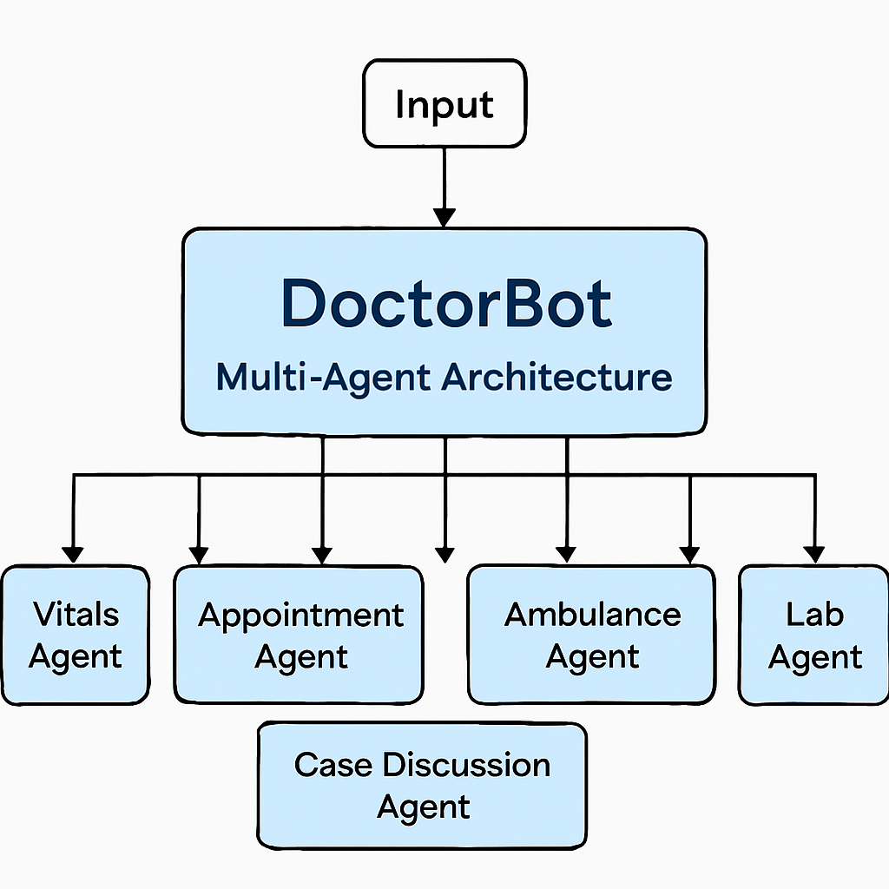

**NOTE:** Refer architecture diagram.

🧩 How to Read This Diagram
- DoctorBot (center): The main interface that receives input from the doctor.
- Agents (around it):
- VitalsAgent → logs patient vitals.
- AppointmentAgent → handles appointment booking.
- CaseDiscussionAgent → forwards case details to another doctor.
- AmbulanceAgent → arranges ambulance services.
- PharmacyAgent → sends medicine orders.
- LabAgent → books lab tests.
Each arrow shows how DoctorBot delegates tasks to the right agent. For now, each agent can simply print to a log file. Later, you can replace logging with real integrations (hospital APIs, pharmacy systems, ambulance dispatch, etc.).

🌟 Why This Works Well
- Modularity: Each agent is independent, so adding/removing features is easy.
- Scalability: You can expand to more agents (insurance, billing, patient history).
- Maintainability: Debugging is simpler because each agent has a single responsibility.
