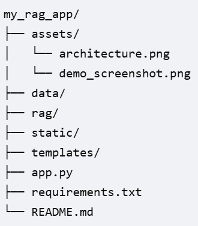

# My RAG Application

# Run following commands to setup your project.

## To create an environment:
### 1. Create virtual environment for your project.
python -m venv venv
venv\Scripts\activate
### 2. To add dependencies, run following command to add all dependencies for your project.
open terminal and run the command: 

pip install -r requirements.txt

## Architecture Overview:
